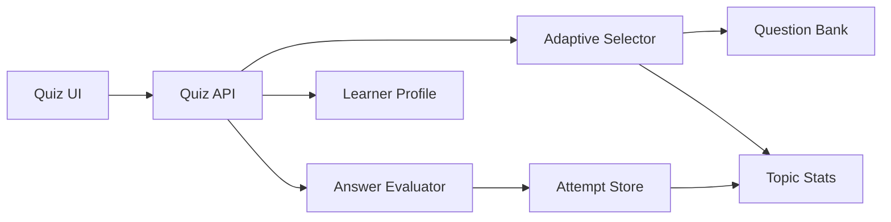

# How To Build An Adaptive Quiz Engine

This guide explains how to design and ship an adaptive quiz engine for any subject area, from chemistry and biology to language learning, certification prep, and interview practice.

The goal is not to build a quiz that simply picks a random next question. The goal is to build a system that uses learner performance to decide what should come next, why it should come next, and how that improves retention.

## 1. Define What “Adaptive” Means

Before you write code, decide what the engine should adapt to.

Common adaptation signals:

- topic weakness
- recent mistakes
- speed of response
- confidence ratings
- question difficulty
- spacing since last review
- mastery targets

A practical first version usually adapts to three things:

1. which topics the learner gets wrong most often
2. which questions were missed recently
3. which question types still have low coverage

That is enough to build a useful engine without adding unnecessary complexity.

## 2. Start With A Simple Learning Model

Treat every question as a data point and every learner as a set of evolving mastery estimates.

At minimum, track:

- learner ID
- question ID
- topic
- question type
- correctness
- timestamp

Useful second-layer signals:

- response time
- attempt number
- answer text or selected option
- confidence score
- session ID
- difficulty label

For each topic or skill, maintain summary fields such as:

- attempts
- correct
- accuracy
- last seen
- recent streak

This gives you fast aggregates for adaptation without reprocessing the full attempt history every time.

## 3. Model Your Content Correctly

Adaptive behavior depends on question metadata. If your content is poorly tagged, the engine cannot make good decisions.

Each question should usually have:

- stable ID
- prompt
- answer key
- topic
- subtopic
- question type
- difficulty
- prerequisites
- explanation or feedback text

Optional but often valuable:

- estimated duration
- tags
- alternate accepted answers
- media references
- learning objective

Example question shape:

```ts
type Question = {
  id: string;
  topic: string;
  subtopic?: string;
  type: "multiple-choice" | "short-answer" | "drawing" | "matching";
  difficulty: 1 | 2 | 3 | 4 | 5;
  prompt: string;
  acceptedAnswers: string[];
  explanation: string;
};
```

Do not make difficulty an afterthought. Even if your first release uses manual difficulty labels, having the field in place lets you improve the engine later.

## 4. Choose The First Adaptation Strategy

You do not need item-response theory on day one.

A strong first strategy is weighted weakness selection:

1. compute a score for each topic
2. rank topics by lowest mastery or lowest accuracy
3. prefer unseen questions in the weakest topic
4. if unseen questions run out, resurface recent mistakes
5. if the learner is already strong everywhere, rotate through older questions to maintain coverage

Example topic score:

$$
score = 0.6 \cdot accuracy + 0.2 \cdot coverage + 0.2 \cdot recency
$$

Where lower values indicate weaker areas.

You can also use a simpler ranking formula:

```ts
function topicPriority(stat: TopicStat) {
  const accuracy = stat.attempts === 0 ? 0.5 : stat.correct / stat.attempts;
  const coveragePenalty = stat.attempts;
  return { accuracy, coveragePenalty };
}
```

Then sort by:

1. lowest accuracy
2. fewest attempts
3. oldest last-seen timestamp

That gets you a solid adaptive engine very quickly.

## 5. Separate Question Selection From Question Evaluation

Keep these concerns independent.

Selection decides:

- which question should appear next

Evaluation decides:

- whether the learner was correct
- what feedback to return
- what progress data to update

Why this matters:

- you can add new question types without rewriting the scheduler
- you can test adaptation logic without the UI
- you can change scoring rules without breaking the bank

Recommended structure:

```ts
type Attempt = {
  learnerId: string;
  questionId: string;
  correct: boolean;
  topic: string;
  type: string;
  createdAt: string;
};

function selectNextQuestion(...): Question {}
function evaluateAnswer(...): EvaluationResult {}
function updateProgress(...): ProgressState {}
```

## 6. Build A Deterministic Selection Pipeline

The next question should come from a clear pipeline, not ad hoc conditionals scattered through the UI.

A practical pipeline:

1. filter by allowed syllabus scope
2. group by topic
3. rank topics by weakness
4. inside the top topic, prefer unseen questions
5. then prefer previously incorrect questions
6. then prefer least-recently-seen questions
7. avoid repeating the current question immediately

Pseudocode:

```ts
function selectNextQuestion(bank, attempts, stats, currentQuestionId) {
  const rankedTopics = rankTopics(stats);

  for (const topic of rankedTopics) {
    const unseen = bank.filter(
      (q) => q.topic === topic && !hasAttempted(q.id, attempts) && q.id !== currentQuestionId,
    );

    if (unseen.length > 0) return unseen[0];
  }

  for (const topic of rankedTopics) {
    const incorrect = bank
      .filter((q) => q.topic === topic && wasLastAttemptWrong(q.id, attempts))
      .sort(sortByMostUsefulRepeat);

    if (incorrect.length > 0) return incorrect[0];
  }

  return leastRecentlySeen(bank, attempts, currentQuestionId);
}
```

The exact scoring can change later. The pipeline shape usually survives multiple product iterations.

## 7. Support More Than One Question Type

A real adaptive engine should not assume all questions are multiple-choice.

Common question types:

- multiple-choice
- short-answer
- numeric answer
- true/false
- free-response
- drawing or construction tasks
- ordering or matching

Each type needs its own evaluator, but all of them can feed the same progress model.

Pattern:

```ts
function evaluateAnswer(question: Question, response: unknown) {
  switch (question.type) {
    case "multiple-choice":
      return evaluateMultipleChoice(question, response);
    case "short-answer":
      return evaluateShortAnswer(question, response);
    case "drawing":
      return evaluateDrawing(question, response);
    default:
      throw new Error("Unsupported question type");
  }
}
```

## 8. Decide How To Handle Difficulty

There are several reasonable ways to use difficulty.

Option 1: difficulty as a filter

- weak learners receive more easy and medium questions first
- strong learners receive more medium and hard questions

Option 2: difficulty as a tie-breaker

- first choose the weakest topic
- then choose a question difficulty aligned to the learner’s recent success

Option 3: explicit mastery ladder

- require success at difficulty 1 before introducing difficulty 2, and so on

For most products, option 2 is the best first implementation because it gives useful adaptation without making the system too rigid.

## 9. Persist The Right Data

You need both raw history and aggregate summaries.

Recommended tables or collections:

- users
- learner profiles
- questions
- attempts
- topic stats
- sessions

Typical relational shape:

```ts
User -> LearnerProfile -> Attempts
LearnerProfile -> TopicStats
Question -> Topic / Type / Difficulty
```

Why store both attempts and topic stats:

- attempts preserve the audit trail
- topic stats make runtime selection cheap

If you only store attempts, selection gets slower over time.
If you only store aggregates, you lose explainability and debugging power.

## 10. Make The Feedback Loop Useful

Adaptation is not just about selection. Feedback should teach.

Good feedback usually contains:

- whether the learner was correct
- the correct answer
- a short explanation
- what skill was being tested
- what will likely happen next

Examples:

- “Correct. This topic is now near mastery, so the engine will rotate to a weaker area.”
- “The carbon skeleton matched, but the double bond was in the wrong position.”
- “You missed a question in electrochemistry again, so the next question will stay in that topic.”

This makes the engine feel intentional instead of random.

## 11. Add Coverage Controls

A naïve adaptive engine can over-focus on one weakness and neglect the rest of the syllabus.

Add guardrails such as:

- max consecutive questions from one topic
- minimum topic coverage across a session
- scheduled review of strong topics
- separate new-question and review-question quotas

Example session policy:

- 60% weak-topic review
- 25% unseen questions
- 15% retention checks from strong topics

These policies make the system more balanced.

## 12. Handle Cold Start Cleanly

When the learner has no history, the engine still needs a plan.

Good cold-start strategies:

- start with broad diagnostic questions
- rotate through one question per topic
- begin at medium difficulty, then branch based on outcome
- ask for self-reported confidence or prior familiarity

Avoid pretending you know the learner’s weaknesses before you have enough evidence.

## 13. Think About Session Design

Adaptation should work within a session and across sessions.

Track:

- current session length
- current topic streak
- fatigue indicators such as rising response times or falling accuracy
- unfinished question sequences

Session-aware rules you may want:

- do not give five hard questions in a row
- stop increasing difficulty after multiple recent misses
- surface a quick win after repeated failure

This is part pedagogy, part product design.

## 14. Build For Explainability

If a learner asks, “Why did I get this question?”, you should be able to answer.

Store lightweight reason codes such as:

- `weak_topic`
- `first_exposure`
- `recent_miss`
- `retention_review`
- `difficulty_step_up`

Then return them in debugging tools or teacher dashboards.

Example:

```ts
type SelectionReason =
  | "weak_topic"
  | "first_exposure"
  | "recent_miss"
  | "retention_review"
  | "difficulty_step_up";
```

Explainability is especially useful when teachers, admins, or curriculum owners need to trust the engine.

## 15. Build A Clean API Surface

A minimal backend usually needs endpoints for:

- loading learner progress
- getting the next question
- submitting an answer
- fetching explanations or review data

Example shape:

```ts
GET /api/quiz/progress?learnerId=...
POST /api/quiz/next
POST /api/quiz/submit
```

Submission input should include enough identity and context to update progress correctly:

```ts
{
  learnerId: "...",
  questionId: "...",
  questionType: "short-answer",
  topic: "stoichiometry",
  response: "..."
}
```

## 16. Add Analytics Early

You will want product and learning analytics almost immediately.

Track:

- question difficulty success rate
- topic-level accuracy trends
- drop-off points in sessions
- average attempts before mastery
- repeat frequency of each question
- which explanations reduce repeat errors

These metrics tell you whether the engine is actually improving outcomes or just increasing activity.

## 17. Test The Engine At Three Levels

You need more than UI tests.

Test level 1: evaluator tests

- correct answers are accepted
- invalid answers are rejected
- alternate accepted answers work

Test level 2: selection logic tests

- weakest topics are ranked first
- unseen questions are preferred before repeats
- recent misses are resurfaced appropriately

Test level 3: end-to-end behavior tests

- login or identity loads the correct profile
- answer submission updates progress
- next-question selection changes after a miss or streak

Example unit test ideas:

```ts
it("prefers unseen questions in the weakest topic", () => {})
it("repeats recent misses before old correct questions", () => {})
it("updates topic accuracy after submission", () => {})
```

## 18. Avoid Common Failure Modes

Watch for these problems:

- overfitting to recent mistakes
- repeating the same question too often
- never revisiting mastered topics
- using weak or missing metadata
- storing only percentages without raw attempts
- mixing selection logic directly into UI components
- making adaptation impossible to explain or debug

If you are seeing one of these, the engine usually needs clearer boundaries or better question metadata.

## 19. Recommended Implementation Order

If you are starting from scratch, build in this order:

1. stable question model
2. answer evaluation
3. attempt storage
4. topic summary stats
5. simple weakness-based selection
6. feedback explanations
7. coverage controls
8. difficulty adaptation
9. analytics and dashboards
10. advanced models such as spaced repetition or probabilistic mastery

That order keeps the system useful at every stage.

## 20. Example Minimal Architecture



Core rule:

- the evaluator determines correctness
- the attempt store preserves history
- the selector reads history and chooses the next question

## 21. When To Use More Advanced Models

After the simple engine works, you can add:

- spaced repetition scheduling
- Bayesian mastery estimation
- item response theory
- prerequisite graphs
- confidence-aware selection
- teacher-assigned learning paths

Only do this after the basic engine is stable and measurable. Most teams overcomplicate adaptation too early.

## 22. Final Build Checklist

- questions have stable IDs and usable metadata
- learner attempts are stored with timestamps
- topic summaries are updated on every submission
- next-question selection is deterministic and testable
- unseen questions are prioritized sensibly
- recent errors resurface without causing loops
- explanations are available for every question
- analytics exist for topic, difficulty, and retention behavior
- the system supports both first-time learners and returning learners
- the selection reason can be explained to teachers or advanced users

## 23. Practical First Version

If you only implement one solid version, make it this:

- tag every question by topic, type, and difficulty
- track attempts and per-topic stats
- rank topics by low accuracy and low coverage
- choose unseen questions before repeats
- revisit recent misses
- rotate mastered topics back in occasionally
- provide clear feedback and explanations

That version is simple enough to ship and strong enough to improve later.

## 24. Summary

An adaptive quiz engine is mainly a decision system built on:

- good question metadata
- reliable evaluation
- persistent learner history
- clear topic mastery summaries
- deterministic next-question selection

Build the simple version first. Make it measurable. Then make it smarter.